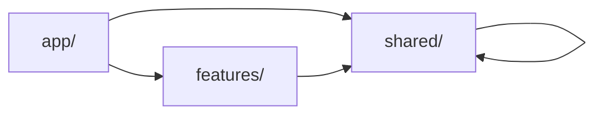

# アーキテクチャドキュメント

## 📐 Features-Based Architecture

Tier Map は **Features-Based Architecture** を採用しています。

### 設計原則

1. **機能の独立性**: 各機能(feature)は完全に独立したモジュール
2. **依存方向の制御**: features → shared のみ許可
3. **Server/Client 分離**: デフォルトは Server Component
4. **直接 import**: Barrel Export（index.ts）は使用しない

---

## 🗂️ ディレクトリ構成

```
src/
├── app/                              # Next.js App Router
│   ├── (public)/                     # 公開ページグループ
│   ├── search/                       # 検索ページ
│   ├── candidates/                   # 候補一覧ページ
│   ├── rallies/                      # ラリー一覧ページ
│   ├── rally/                        # ラリー関連ページ
│   │   ├── create/                   # ラリー作成
│   │   └── [id]/                     # ラリー詳細・評価・ティア・共有
│   ├── api/                          # APIルート
│   ├── layout.tsx                    # ルートレイアウト
│   └── page.tsx                      # ホームページ
│
├── features/                         # 機能別モジュール（ドメイン駆動）
│   ├── search/                       # スポット検索機能
│   │   ├── components/               # SearchForm等のUI
│   │   ├── hooks/                    # useSearchForm等
│   │   ├── types/                    # SearchParams等の型
│   │   └── constants/                # GENRES等の定数
│   │
│   ├── candidates/                   # 候補スポット一覧・選択機能
│   │   ├── components/               # SpotList, SpotMap等
│   │   ├── hooks/                    # useSpotSelection等
│   │   ├── types/                    # Spot型等
│   │   └── lib/                      # google-places API呼び出し
│   │
│   ├── rally/                        # ラリー作成・管理機能
│   │   ├── components/               # RallyForm, SortableSpotList等
│   │   ├── hooks/                    # useRallyForm, useDragAndDrop等
│   │   ├── types/                    # Rally型等
│   │   └── constants/                # STATUS_LABELS等
│   │
│   ├── evaluation/                   # スポット評価機能
│   │   ├── components/               # EvaluationForm, StarRating等
│   │   ├── hooks/                    # useStarRating等
│   │   └── types/                    # SpotEvaluation型等
│   │
│   ├── tier/                         # ティア表生成・表示機能
│   │   ├── components/               # TierTable, TierSection等
│   │   ├── types/                    # TierRank, TierSpot型等
│   │   ├── constants/                # TIER_COLORS等
│   │   └── lib/                      # tier-calculator.ts
│   │
│   └── share/                        # 共有機能
│       ├── components/               # ShareCard, ShareButtons等
│       ├── hooks/                    # useShare, useClipboard等
│       ├── types/                    # ShareType型等
│       ├── constants/                # SHARE_PLATFORMS等
│       └── lib/                      # share-utils.ts
│
└── shared/                           # 共通リソース（横断的関心事）
    ├── components/                   # 共通UIコンポーネント
    │   ├── ui/                       # shadcn/ui (Button, Card等)
    │   ├── layout/                   # Header, Footer等
    │   └── common/                   # LoadingSpinner等
    │
    ├── hooks/                        # 共通カスタムフック
    │   ├── useDebounce.ts
    │   ├── useLocalStorage.ts
    │   └── useMediaQuery.ts
    │
    ├── lib/                          # ユーティリティ・API
    │   ├── server/                   # Server側専用
    │   │   ├── supabase/             # DB操作
    │   │   └── google/               # Google API
    │   ├── client/                   # Client側専用
    │   ├── analytics.ts              # イベントトラッキング
    │   └── utils.ts                  # cn()等
    │
    ├── types/                        # 共通型定義
    │   ├── spot.ts                   # Spot, Rally, SpotEvaluation型
    │   └── api.ts                    # API共通型
    │
    │
    └── constants/                    # 共通定数
        ├── routes.ts                 # ルート定義
        └── config.ts                 # 設定値
```

---

## 🔀 依存関係ルール

### ✅ 許可される依存



```typescript
// ✅ app → features
import { SearchForm } from '@features/search/components/SearchForm';

// ✅ app → shared
import { Button } from '@shared/components/ui/button';

// ✅ features → shared
import { Button } from '@shared/components/ui/button';
import type { Spot } from '@shared/types/spot';

// ✅ shared → shared
import { cn } from '@shared/lib/utils';
```

### ❌ 禁止される依存

```typescript
// ❌ features → features
import { RallyCard } from '@features/rally/components/RallyCard';

// ❌ shared → features
import { SearchForm } from '@features/search/components/SearchForm';
```

**理由**: features 間の結合を避け、保守性を向上させるため

---

## 🎯 各レイヤーの責務

### app/ (Presentation Layer)

**責務**:

- ルーティング定義
- ページレベルのデータ取得
- レイアウト定義

**実装ルール**:

- features/ と shared/ から import のみ
- ビジネスロジックは含めない
- Server Component を基本とする

**例**:

```typescript
// src/app/search/page.tsx
import { SearchForm } from '@features/search/components/SearchForm';

export default function SearchPage() {
  return (
    <div className="container">
      <SearchForm />
    </div>
  );
}
```

### features/ (Domain Layer)

**責務**:

- ビジネスロジックの実装
- ドメイン固有の UI
- ドメイン固有の状態管理

**実装ルール**:

- shared/ のみ依存可能
- 他の features/ に依存禁止
- ドメイン内で完結させる

**例**:

```typescript
// src/features/search/components/SearchForm.tsx
'use client';

import { Button } from '@shared/components/ui/button';
import { useSearchForm } from '../hooks/useSearchForm';
import { GENRES } from '../constants/genres';

export function SearchForm() {
  // ドメインロジック
}
```

### shared/ (Infrastructure Layer)

**責務**:

- 汎用的な UI コンポーネント
- 汎用的なユーティリティ
- API 呼び出し・DB 操作
- 共通型定義

**実装ルール**:

- features/ に依存禁止
- shared/ 内のみ依存可能
- ドメイン知識を含めない

**例**:

```typescript
// src/shared/lib/utils.ts
export function cn(...inputs: ClassValue[]) {
  return twMerge(clsx(inputs));
}
```

---

## 🔍 Import Path Aliases

### 設定（tsconfig.json）

```json
{
  "compilerOptions": {
    "paths": {
      "@/*": ["./src/*"],
      "@features/*": ["./src/features/*"],
      "@shared/*": ["./src/shared/*"]
    }
  }
}
```

### 使用例

```typescript
// ❌ 相対パス（長くて可読性が低い）
import { Button } from '../../../shared/components/ui/button';

// ✅ エイリアス（短くて可読性が高い）
import { Button } from '@shared/components/ui/button';
```

---

## 🛡️ ESLint による依存関係の強制

### eslint-plugin-boundaries

`eslint-plugin-boundaries` により、依存関係ルールを自動検出します。

**設定**:

```javascript
// eslint.config.mjs
{
  rules: {
    "boundaries/element-types": [
      "error",
      {
        default: "disallow",
        rules: [
          {
            from: "features",
            allow: ["shared"],
            message: "Features can only import from shared."
          },
          {
            from: "app",
            allow: ["features", "shared"],
          },
          {
            from: "shared",
            allow: ["shared"],
            message: "Shared cannot import from features."
          },
        ],
      },
    ],
  },
}
```

**違反例**:

```typescript
// features/search/components/SearchForm.tsx
import { RallyCard } from '@features/rally/components/RallyCard';
// ❌ Error: Features can only import from shared.
```

---

## 🔄 Server/Client Component 分離

### Server Component（デフォルト）

**使用ケース**:

- データ取得が必要
- SEO が重要
- インタラクティブでない

**例**:

```typescript
// Server Component
export async function RallyList() {
  const rallies = await getRallies(); // Server側でデータ取得

  return (
    <div>
      {rallies.map((rally) => (
        <RallyCard key={rally.id} rally={rally} />
      ))}
    </div>
  );
}
```

### Client Component（必要時のみ）

**使用ケース**:

- State が必要
- イベントハンドラが必要
- ブラウザ API を使用

**例**:

```typescript
// Client Component
'use client';

import { useState } from 'react';

export function SearchForm() {
  const [region, setRegion] = useState('');
  // ... state管理
}
```

**重要**: `"use client"` は必要最小限に。

---

## 📦 Feature の分割基準

### ✅ 独立した Feature にすべき例

- 独自の UI とロジックを持つ
- 他の機能から独立して動作する
- 再利用性が低い

**例**: `search`, `evaluation`, `tier`

### ❌ shared/ にすべき例

- 複数の feature から使用される
- ドメイン知識を含まない
- 汎用的な機能

**例**: `Button`, `useDebounce`, `formatDate`

---

## 🧪 テスト戦略

### Unit Test（Feature 単位）

```typescript
// src/features/search/hooks/useSearchForm.test.ts
import { renderHook } from '@testing-library/react';
import { useSearchForm } from './useSearchForm';

describe('useSearchForm', () => {
  it('should validate form data', () => {
    // ...
  });
});
```

### Integration Test（Feature 間）

```typescript
// src/app/search/page.test.tsx
import { render } from '@testing-library/react';
import SearchPage from './page';

describe('SearchPage', () => {
  it('should render search form', () => {
    // ...
  });
});
```

---

## 📈 パフォーマンス最適化

### Code Splitting

Features-Based Architecture により、自動的に code splitting が適用されます。

```typescript
// 動的import（必要時のみロード）
const HeavyComponent = dynamic(() => import('@features/heavy/components/HeavyComponent'));
```

### Server Actions

Server Component でのデータ取得により、バンドルサイズを削減。

```typescript
// app/rallies/page.tsx
import { getRallies } from '@shared/lib/server/supabase/rallies';

export default async function RalliesPage() {
  const rallies = await getRallies(); // Serverで実行
  return <RallyList rallies={rallies} />;
}
```

---

## 🔄 マイグレーション履歴

### 2025-10-31: Features-Based Architecture 導入

**Before**:

```
src/
├── components/  # UI混在
├── lib/         # ロジック混在
└── types/       # 型混在
```

**After**:

```
src/
├── app/         # ルーティングのみ
├── features/    # 機能別に完全分離
└── shared/      # 共通リソース
```

**改善点**:

- ✅ 機能の独立性向上
- ✅ 依存関係の明確化
- ✅ テスト容易性の向上
- ✅ チーム開発の並行性向上

---

## 📚 参考資料

- [Next.js App Router](https://nextjs.org/docs/app)
- [Feature-Sliced Design](https://feature-sliced.design/)
- [Clean Architecture](https://blog.cleancoder.com/uncle-bob/2012/08/13/the-clean-architecture.html)
- [ESLint Plugin Boundaries](https://github.com/javierbrea/eslint-plugin-boundaries)

---

**更新日**: 2025 年 10 月 31 日
**バージョン**: 1.0.0
